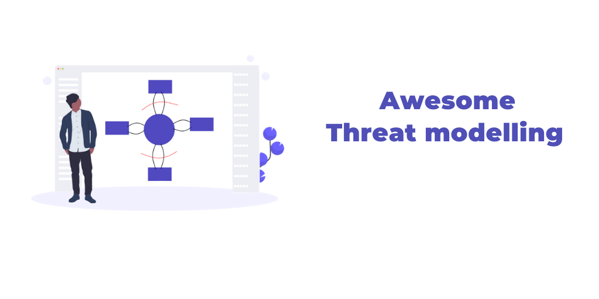

# Awesome Threat Modeling 

A curated list of threat modeling resources (books, courses - free and paid, videos, tools, tutorials and workshop to practice on) for learning Threat modeling and initial phases of security review.

Contributions welcome. Add links through pull requests or create an issue to start a discussion.

## Contents
- [Fundamentals](#fundamentals)
- [Books](#books)
- [Courses](#courses)
- [Videos](#videos)
- [Tutorials and Blogs](#tutorials-and-blogs)
- [Threat Model examples](#threat-model-examples)
- [Tools](#tools)
- [Sponsor](#sponsor)

## Fundamentals

- [The Threat Modeling Manifesto](https://www.threatmodelingmanifesto.org)

## Books

*Books on threat modeling.*

- [Threat Modeling: Designing for Security](https://www.amazon.com/Threat-Modeling-Designing-Adam-Shostack/dp/1118809998)

- [Threat Modeling](https://www.amazon.in/Threat-Modeling-Microsoft-Professional-Swiderski/dp/0735619913)

- [Risk Centric Threat Modeling: Process for Attack Simulation and Threat Analysis](https://www.amazon.in/Risk-Centric-Threat-Modeling-Simulation/dp/0470500964)

- [Threat Modeling: A Practical Guide for Development Teams](https://www.oreilly.com/library/view/threat-modeling/9781492056546/)

## Courses

*Courses/Training videos on threat modeling.*

### Free

- [Threat Modeling, or Architectural Risk Analysis by Coursera](https://www.coursera.org/lecture/software-security/threat-modeling-or-architectural-risk-analysis-bQAoU)

- [Threat Modeling Workshop by Robert Hurlbut](https://github.com/rhurlbut/CodeMash2019/blob/master/Robert-Hurlbut-CodeMash2019-Threat-Modeling-Workshop-20190108.pdf)
- [Rapid Threat Model Prototyping (RTMP)](https://github.com/geoffrey-hill-tutamantic/rapid-threat-model-prototyping-docs) - Methodology to create quick threat models (1) add threat metadata describing the threats and mitigations directly to software diagrams using 11 simple and repeatable steps (2) integrate these steps into Agile workstreams (3) how to best use the outputs of a threat model (Threats & Mitigations)

### Paid

- [DevSecOps Expert by Practical DevSecOps](https://www.practical-devsecops.com/certified-devsecops-expert/)

- [Threat Modeling Fundamentals](https://www.pluralsight.com/courses/threat-modeling-fundamentals)

- [CyberSec First Responder: Threat Detection & Response CFR210](https://www.udemy.com/course/cybersec-first-responder-threat-detection-response-cfr210/)

- [Learning Threat Modeling for Security Professionals](https://www.lynda.com/Web-Development-tutorials/Learning-Threat-Modeling-Security-Professionals/769294-2.html)

- [Threat Modeling: Spoofing In Depth](https://www.lynda.com/IT-tutorials/Threat-Modeling-Spoofing-Depth/769300-2.html?srchtrk=index%3a7%0alinktypeid%3a2%0aq%3athreat+modelling%0apage%3a1%0as%3arelevance%0asa%3atrue%0aproducttypeid%3a2)

- [Threat Modeling: Tampering in Depth](https://www.lynda.com/IT-tutorials/Threat-Modeling-Tampering-Depth/2810167-2.html?srchtrk=index%3a1%0alinktypeid%3a2%0aq%3athreat+modelling%0apage%3a1%0as%3arelevance%0asa%3atrue%0aproducttypeid%3a2)

- [Threat Modeling or Whiteboard Hacking training](https://www.toreon.com/threatmodeling/)

- [Kubernetes Threat Modeling](https://learning.oreilly.com/live-events/kubernetes-threat-modeling/0636920055610/0636920059945/)

## Videos

*Videos talking about Threat modeling.*

- [Introduction, Threat Models](https://www.youtube.com/watch?v=GqmQg-cszw4)

- [Creating a Threat Model using TMT 2016](https://www.youtube.com/watch?v=-VokDIHS5XM)

- [Using Threat Modeling](https://www.youtube.com/watch?v=n8ozucTo810)

- [Threat Modeling in 2019](https://www.youtube.com/watch?v=ZoxHIpzaZ6U)

- [Threat Modeling Toolkit](https://www.youtube.com/watch?v=KGy_KCRUGd4)

- [Adaptive Threat Modelling](https://www.youtube.com/watch?v=YTtO_TGV2fU)

- [Threat modeling](https://www.youtube.com/watch?v=v8aYNcE1QlI)

- [Threat Model Every Story: Practical Continuous Threat Modeling Work for Your Team](https://www.youtube.com/watch?v=VbW-X0j35gw)

- [Threat Modeling for Secure Software Design](https://www.youtube.com/watch?v=OH2LqzDk2Zg)

- [Fixing Threat Models with OWASP Efforts](https://www.youtube.com/watch?v=-dQcg0FDLpk)

- [Designing for Security through Threat Modelling](https://www.youtube.com/watch?v=6fhEdJ9YcU0)

- [Unlocking Threat Modeling](https://www.youtube.com/watch?v=J_ksjjUz73s)

- [An Agile Approach to Threat Modeling for Securing Open Source Project EdgeX Foundry](https://www.youtube.com/watch?v=iw-FzeKaj48)

- [Threat Modeling 101 (SAFECode On Demand Training Course)](https://www.youtube.com/watch?v=QQ7StGiy_-M)

- [ISO/SAE 21434 by Example](https://youtu.be/3LsNx-ljIK8?t=1180)

- [Introduction to Threat Modeling by Avi Douglen](https://www.youtube.com/watch?v=yjvSI755auM&t=5069s)

- [Look, there's a threat model in my DevOps](https://www.youtube.com/watch?v=ASwZ7cnz-Q4&ab_channel=Auth0)

## Tutorials and Blogs

*Tutorials and blogs that explain threat modeling*

- [Threat Modeling: What, Why, and How?](https://misti.com/infosec-insider/threat-modeling-what-why-and-how)

- [Threat Modeling: 12 Available Methods](https://insights.sei.cmu.edu/sei_blog/2018/12/threat-modeling-12-available-methods.html)

- [What Is Security Threat Modeling?](https://www.dummies.com/programming/certification/security-threat-modeling/)

- [Threat-modeling CheatSheet By Owasp](https://cheatsheetseries.owasp.org/cheatsheets/Threat_Modeling_Cheat_Sheet.html)

- [Threat Modeling in the Enterprise](https://securityintelligence.com/threat-modeling-in-the-enterprise-part-1-understanding-the-basics/)

- [Approachable threat modeling](https://increment.com/security/approachable-threat-modeling/)

- [Threat Modeling for Dummies](https://www.slideshare.net/AdamEnglander/threat-modeling-for-dummies-cascadia-php-2018)

- [DevSecOps, Threat Modeling and You: Get started using the STRIDE method](https://medium.com/@brunoamaroalmeida/devsecops-threat-modelling-and-you-get-started-using-the-stride-method-85d143ab86f4)

- [Threat Modeling: The Why, How, When and Which Tools](https://devops.com/threat-modeling-the-why-how-when-and-which-tools/)

- [Threat-modeling datasheet](https://www.synopsys.com/content/dam/synopsys/sig-assets/datasheets/threat-modeling-datasheet.pdf)

- [Threat Modeling blog](https://blog.securityinnovation.com/topic/threat-modeling)

- [Threat Modeling: 6 Mistakes You are Probably Making](https://www.varonis.com/blog/threat-modeling/)

- [How to Create a Threat Model for Cloud Infrastructure Security](https://www.threatstack.com/blog/how-to-create-a-threat-model-for-cloud-infrastructure-security)

- [Why You Should Care About Threat Modelling](https://community.arm.com/developer/ip-products/security/b/security-ip-blog/posts/why-you-should-care-about-threat-modelling)

- [Benefits of Threat Modeling](https://nvisium.com/blog/2019/05/30/benefits-of-threat-modeling.html)

- [Threat Modeling: a Summary of Available Methods Whitepaper](https://resources.sei.cmu.edu/asset_files/WhitePaper/2018_019_001_524597.pdf)

- [Threat Modelling Toolkit](https://owasp.org/www-pdf-archive/Threat_Modelling_-_STRIDE_Cards_-_TW_Branded.pdf)

- [How to get started with Threat Modeling, before you get hacked](https://hackernoon.com/how-to-get-started-with-threat-modeling-before-you-get-hacked-1bf0ea3310df)

- [Thread Modeling tutorial](https://www.geeksforgeeks.org/threat-modelling/)

- [How to analyze the security of your application with threat modeling](https://www.freecodecamp.org/news/threat-modeling-goran-aviani/)

- [Tactical Threat Modeling](https://safecode.org/wp-content/uploads/2017/05/SAFECode_TM_Whitepaper.pdf)

- [The Power of a Tailored Threat Model Whitepaper](https://www.lookingglasscyber.com/resources/white-papers/the-power-of-a-tailored-threat-model/)

- [7 Easy Steps For Building a Scalable Threat Modeling Process](https://threatmodeler.com/wp-content/uploads/2018/12/7-Easy-Steps-for-Building-a-Scalable-Threat-Modeling-Process-copy.pdf)

- [Where is my Threat Model?](https://blog.appsecco.com/where-is-my-threat-model-b6f8b077ac47)

- [Secure Slack bot an exercise in threat modeling](https://diablohorn.com/2019/11/18/secure-slack-bot-an-exercise-in-threat-modeling/)

- [Secpillars.com Threat Modeling blog posts](https://blog.secpillars.com/search/label/Threat%20Modeling)

## Threat Model examples

*Threat model examples for reference.*

- [OAuth 2.0 Threat Model and Security Considerations](https://datatracker.ietf.org/doc/html/rfc6819)

- [SSL Threat model by Qualys](https://www.ssllabs.com/downloads/SSL_Threat_Model.png)

- [DNS Security: Threat Modeling DNSSEC, DoT, and DoH by Jan Schuamann](https://www.netmeister.org/blog/doh-dot-dnssec.html)

- [Email Encryption Gateway Threat model by NCC Group](https://www.slideshare.net/NCC_Group/real-world-application-threat-modelling-by-example)

- [OWASP Threat Model Cookbook](https://github.com/OWASP/threat-model-cookbook)

- [Kubernetes Threat Model](https://github.com/kubernetes/sig-security/tree/main/sig-security-external-audit/security-audit-2019/findings)

- [ISO/SAE 21434 Annex G Example](https://github.com/Yakindu/YSA-examples)

- [Secure Trusted Firmware for ARM processors](https://tf-m-user-guide.trustedfirmware.org/docs/security/threat_models/generic_threat_model.html)

## Tools

*Tools which helps in threat modelling.*

### Free tools

- [OWASP Threat Dragon](https://owasp.org/www-project-threat-dragon/) - An online threat modelling web application including system diagramming and a rule engine to auto-generate threats/mitigations.

- [Microsoft Threat Modeling Tool](https://docs.microsoft.com/en-gb/azure/security/develop/threat-modeling-tool) - Microsoft Threat Modeling Tool 2016 is a tool that helps in finding threats in the design phase of software projects.

- [Owasp-threat-dragon-gitlab](https://github.com/appsecco/owasp-threat-dragon-gitlab) - This project is a fork of the original OWASP Threat Dragon web application by Mike Goodwin with Gitlab integration instead of GitHub. You can use it with the Gitlab.com or your own instance of Gitlab.

- [Raindance](https://github.com/devsecops/raindance) - Project intended to make Attack Maps part of software development by reducing the time it takes to complete them.

- [Threatspec](https://threatspec.org/) - Threatspec is an open source project that aims to close the gap between development and security by bringing the threat modelling process further into the development process.

- [PyTM](https://github.com/izar/pytm) - PyTM is an open source project providing a library for threat modeling with code. Describe your system using OO syntax (object.property = value) and have your threat modeling report automatically generated. 100+ threats currently supported.

- [MAL](https://mal-lang.org) - MAL is an open source project that supports creation of cyber threat modeling systems and attack simulations. 

- [Threagile](https://github.com/Threagile/threagile) - Threagile is an open-source toolkit for agile threat modeling

- [TicTaaC](https://github.com/rusakovichma/TicTaaC) - Threat modeling-as-a-Code in a Tick (TicTaaC). Lightweight and easy-to-use Threat modeling solution following DevSecOps principles

- [Threat Modeling Online Game](https://github.com/dehydr8/elevation-of-privilege) - Online version of the Elevation of Privilege and Cornucopia card games. The easy way to get started with threat modeling.

- [Deciduous](https://github.com/rpetrich/deciduous) - A web app that simplifies building attack decision trees. Hosted at https://www.deciduous.app/

### Paid tools

- [Irius risk](https://iriusrisk.com/threat-modeling-tool/) - Iriusrisk is a threat modeling tool with an adaptive questionnaire driven by an expert system which guides the user through straight forward questions about the technical architecture, the planned features and security context of the application.
- [SD elements](https://www.securitycompass.com/sdelements/threat-modeling/) - Automate Threat Modeling with SD Elements.
- [Foreseeti](https://www.foreseeti.com/) - SecuriCAD Vanguard is an attack simulation and automated threat modeling SaaS service that enables you to automatically simulate attacks on a virtual model of your AWS environment.
- [Tutamen Threat Model system](https://www.tutamantic.com) - This tool allows threat model metadata to be added to any software diagram, turning that diagram into a threat model. It's simple to use, requires no lock-in license, and is driven by the Common Weakness Enumeration, STRIDE and OWASP Top 10.
- [YAKINDU Security Analyst](https://www.itemis.com/de/yakindu/security-analyst/) - YAKINDU Security Analyst is a model-based software tool for threat analysis and risk assessment of technical systems. You can identify your protection needs, analyze possible threats and calculate the resulting risks. The underlying assessment model and calculation logic are highly customizable and can be integrated into existing toolchains.

## Sponsor

## Contributing

Please refer the guidelines at [contributing.md for details](Contributing.md).
